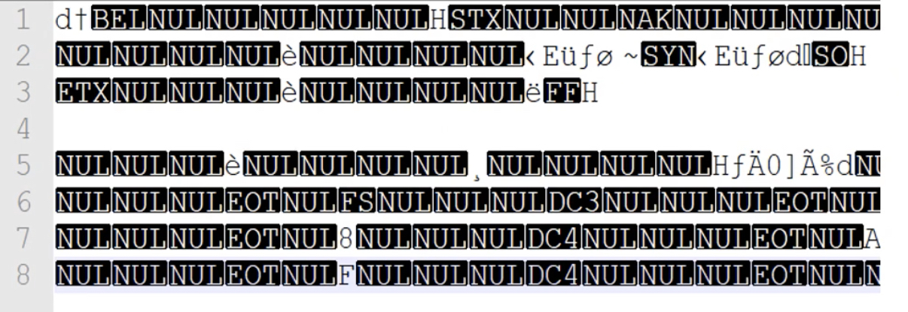
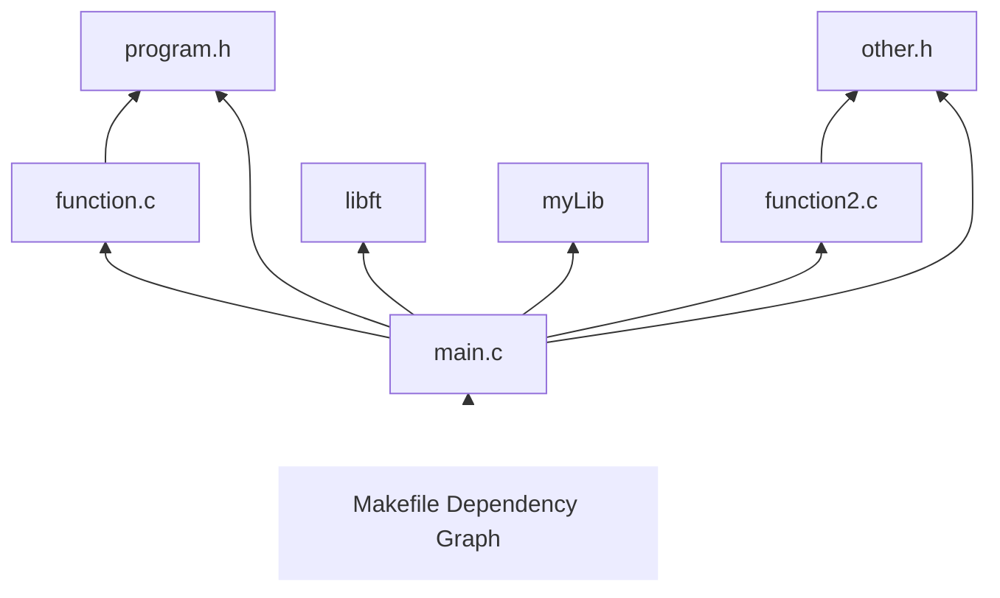

<p align="center">

</p>

<hr>
<details><summary>Table of Contents</summary>
<br>

- [Goal of this README](#goal-of-this-readme)
- [Objectives for this Makefile](#objectives-for-this-makefile)
- [Result of this learning process](#result-of-this-learning-process)
- [Now let's learn about Makefiles](#now-let-s-learn-about-makefiles)
	* [Compilation theory](#compilation-theory)
		+ [Compilation steps](#compilation-steps)
		+ [Preprocessing](#preprocessing)
		+ [Compilation](#compilation)
		+ [Assembly](#assembly)
		+ [Linking](#linking)
	* [What a Makefile Rule looks like](#what-a-makefile-rule-looks-like)
	* [How `make` processes a Makefile](#how--make--processes-a-makefile)
	* [Using variables to make Makefiles simpler](#using-variables-to-make-makefiles-simpler)
	* [Letting `make` deduce the recipes](#letting--make--deduce-the-recipes)
	* [Another style of Makefile (the one we use at 42)](#another-style-of-makefile--the-one-we-use-at-42-)
	* [Rules for cleaning the directory](#rules-for-cleaning-the-directory)
	* [Writing Makefiles](#writing-makefiles)
		+ [Splitting lines](#splitting-lines)
		+ [Naming the Makefile](#naming-the-makefile)
		+ [Including other Makefiles](#including-other-makefiles)
		+ [How `make` reads a Makefile](#how--make--reads-a-makefile)
		+ [How Makefiles are parsed](#how-makefiles-are-parsed)
	* [Writing rules](#writing-rules)
		- [Rule example](#rule-example)
		+ [Rule syntax](#rule-syntax)
		+ [Types of prerequisites](#types-of-prerequisites)
			- [Normal prerequisites](#normal-prerequisites)
			- [Order-only prerequisites](#order-only-prerequisites)
			- [Usage](#usage)
		+ [Using wildcard characters in file names](#using-wildcard-characters-in-file-names)
			- [Wildcard examples](#wildcard-examples)
		+ [The function `wildcard`](#the-function--wildcard-)
		+ [Static pattern rules](#static-pattern-rules)
			- [Syntax](#syntax)
- [Resources](#resources)

</details>
<hr>

# Goal of this README

For the first few projects at 42, I have used Makefiles without fully understanding them, as I have realized is pretty common amongst my peers. At some point, we've got a Makefile that works, and we keep using it because our main focus are the programs we are working on for our projects. This has led to some frustration, as I really don't like submitting work that features parts I haven't 100% understood, and I also need to be able to fix things that do not work as expected. Turns out I could not ✨

My goal here is to study the documentation around Makefiles and the `make` utility, as well as the surrounding processes that I haven't necessarily made the effort to fully grasp, like **compilation**.

I predict there will be a lot of sections identical to the official [GNU documentation](https://www.gnu.org/software/make/manual/make.html) but that is fine, it helps me learn and will, in the end, provide a curated resource for my needs.

The **end goal** of this first step is to build a solid basic understanding of Makefiles, and use it to write a working Makefile template that is my own, and that I will be able to use for my upcoming 42 projects.  

> 🚨 This README **will definitely** be missing some information/details, because I'm only taking what _I think_ is enough for me. If you're using this documentation to build your Makefile and something just does not work as expected, please refer to the corresponding section in the [GNU documentation](https://www.gnu.org/software/make/manual/make.html). 🚨

# Objectives for this Makefile

<details><summary>(Click to expand objectives) 🔎</summary>

- [x] Be clearly written and divided into sections, the main one being the variables that are meant to be edited to customize the Makefile for each project and its needs.
- [x] It should update my executable when any of the source files (including header files) is updated. (_I know that's what Makefiles **do**, but still._)
  - [x] And update my executable when _any_ of the libraries it depends on is updated, especially when it's my own library with its own Makefile.
    - I think this works but I need to check in more detail.
- [x] Independently look for all the source files by itself in the necessary folders, avoiding me the task of listing them one by one. I know this can be done I just want to make it happen.
- [x] I also want the Makefile to display colored messages that will help users understand what is going on (and be fun to look at).
Bonus:
- [ ] Maybe add some useful rules, like "debug" to compile with the `-g` flag, or `leaks` to use `debug` and then run `valgrind` on the program.
  - I could also add a few commands that run Valgrind and grep a possible '0 leaks' output and then outputs either "No leaks found", or the valgrind output if leaks are actually found.
    - This could be called `make harriet` 🔎

</details>

# Result of this learning process

My [Makefile template](Makefile) :)

  

❗️42 requires students to list all the sources used in their Makefile as part of the norm, so I made a [second one](Makefile_for_42) for this reason.

# Now let's learn about Makefiles


The make program uses the makefile database and the last-modification times of the files to decide which of the files need to be updated.

**Consequences of updating files**
+ When make recompiles the editor, each changed C source file must be recompiled.  
+ If a header file has changed, each C source file that includes the header file must be recompiled to be safe. Each compilation produces an object file corresponding to the source file.  
+ Finally, if any source file has been recompiled, all the object files, whether newly made or saved from previous compilations, must be linked together to produce the new executable editor.

## Compilation theory

<details><summary><b>Understanding the compilation process 🧱 </b></summary>
<br>

> Compilation is the process of translating the code you write into a language that is native to the machine you are targeting.


### Compilation steps


### Preprocessing
In pre-processed (.i) files:
+ Header files are included
+ All Macros are resolved (replaced with their values)
+ Comments are removed.

You can see what your .i file looks like by running the following command to pre-process it:
```shell
$ gcc -E yourFile.c
```

This main.c file:
```C
#include "main.h"

#define MESSAGE "Bof."

/* This program prints a happy message */
int	main(void)
{
	printf("%s", MESSAGE);
	return (0);
}
```

and its corresponding .h file:
```C
#ifndef MAIN_H
# define MAIN_H

#include <stdio.h>

#endif
```

Would be pre-processed into this main.i file:
```C
# 400 "/Library/Developer/CommandLineTools/SDKs/MacOSX.sdk/usr/include/stdio.h" 2 3 4
# 5 "./main.h" 2
# 2 "main.c" 2

int main(void)
{
 printf("%s", "Bof.");
 return (0);
}
```

### Compilation

Compilation takes pre-processed files as input, and converts this high-level source code into **assembly instructions**, which are **specific to the target processor architecture**.

It generates a .s file.

You can generate this file with the following command:
```shell
$ gcc -S yourFile.c
# This will run the preprocessor (cpp) over yourFile.c, perform the initial compilation and then stop before the assembler is run.
```

The .s file of my main.c looks like this:
```c
	.section	__TEXT,__text,regular,pure_instructions
	.build_version macos, 12, 0	sdk_version 12, 0
	.globl	_main                           ## -- Begin function main
	.p2align	4, 0x90
_main:                                  ## @main
	.cfi_startproc
## %bb.0:
	pushq	%rbp
	.cfi_def_cfa_offset 16
	.cfi_offset %rbp, -16
	movq	%rsp, %rbp
	.cfi_def_cfa_register %rbp
	subq	$16, %rsp
	movl	$0, -4(%rbp)
	leaq	L_.str(%rip), %rdi
	leaq	L_.str.1(%rip), %rsi
	movb	$0, %al
	callq	_printf
	xorl	%eax, %eax
	addq	$16, %rsp
	popq	%rbp
	retq
	.cfi_endproc
                                        ## -- End function
	.section	__TEXT,__cstring,cstring_literals
L_.str:                                 ## @.str
	.asciz	"%s"

L_.str.1:                               ## @.str.1
	.asciz	"Bof."

.subsections_via_symbols
```

### Assembly

Converts the assembly instructions that resulted from the compilation, and generated **object code** with .o extension.

The output consists of actual instructions to be run by the target processor.

You can generate .o files with the following command:

```shell
$ gcc -c yourFile.c
```

The following file might look like something like this:



### Linking

Until now we have only included header files, which contain function declarations, like the `printf()` used in our program, which still has no definition.  
It will be defined in the corresponding library files.

So **Linking** is the final stage of compilation, it takes all the **static libraries** and **object files** and generates a **single executable**.  
This executable extension will be `.out` on Linux platforms, and `.exe` on windows platforms.

Sources:  
[This video](https://www.youtube.com/watch?v=8XBsNtx6Wyk)

</details>
<hr>

## What a Makefile Rule looks like

```makefile
target ... : prerequisites ...
	recipe
	...
	...
```

**Target**  
Usually the name of a file that is generated by a program. It can also be the name of an action to carry out, like `clean`.  

**Prerequisites**  
Files that are used as input to create the target. A target often needs several files.  

**Recipe**  
An action that `make` carries out. A recipe can have one or several commands on individual lines.  

🚨 All recipes must begin with a `TAB` character ! That's how the makefile differentiates recipes from the other lines in the Makefile.

> Not all Makefile rules need prerequisites. For example, the rule containing the delete command associated with the target `clean` does not have prerequisites.
> 
> The target ‘clean’ is not a file, but merely the name of an action. Since you normally do not want to carry out the actions in this rule, ‘clean’ is not a prerequisite of any other rule. Consequently, make never does anything with it unless you tell it specifically. Note that this rule not only is not a prerequisite, it also does not have any prerequisites, so the only purpose of the rule is to run the specified recipe.


Link: [A Simple Makefile](https://www.gnu.org/software/make/manual/make.html#Simple-Makefile)

## How `make` processes a Makefile

Here is a simple Makefile:

```Makefile
edit : main.o kbd.o command.o display.o \
       insert.o search.o files.o utils.o
        cc -o edit main.o kbd.o command.o display.o \
                   insert.o search.o files.o utils.o

main.o : main.c defs.h
        cc -c main.c
kbd.o : kbd.c defs.h command.h
        cc -c kbd.c
command.o : command.c defs.h command.h
        cc -c command.c
display.o : display.c defs.h buffer.h
        cc -c display.c
insert.o : insert.c defs.h buffer.h
        cc -c insert.c
search.o : search.c defs.h buffer.h
        cc -c search.c
files.o : files.c defs.h buffer.h command.h
        cc -c files.c
utils.o : utils.c defs.h
        cc -c utils.c
clean :
        rm edit main.o kbd.o command.o display.o \
           insert.o search.o files.o utils.o
```

By default, `make` starts with the first target. This is called the _detault goal_.

> Goals are the targets that `make` strives ultimately to update.

In a simple Makefile, the default goal is to _update_ the executable generated, here the executable program `edit`.

`make` reads the makefile in the current directory and begins by processing the first rule.  
In this example, this rule is for relinking `edit`, but before `make` can fully process this rule, it must process the rules for the files that `edit` depends on, which in this case are the object files.  
Each of these files is processed according to its own rule. These rules say to update each `.o` file by compiling its source file. The recompilation must be done if the source file, or any of the header files named as prerequisites, is more recent than the object file, or if the object file does not exist.

The other rules are processed because their targets appear as prerequisites of the goal. If some other rule is not depended on by the goal, that rule is not processed, unless you tell `make` to do so (with a command such as `make clean`).

**Before recompiling** an object file, `make` considers updating its prerequisites: the source file and header files. This makefile does not specify anything to be done for them–the `.c` and `.h` files are not the targets of any rules– so `make` does nothing for these files. But it would update automatically generated C programs, by their own rules at this time.

**After recompiling** whichever object files need it, `make` decides whether to relink `edit`. This must be done if the file `edit` does not exist, or if any of the object files are newer than it. If an object file was just recompiled, it is now newer than `edit`, so `edit` is relinked.

Thus, if we change the file `insert.c` and run `make`, make will compile that file to update `insert.o`, and then link `edit`. If we change the file `command.h` and run `make`, `make` will recompile the object files `kbd.o`, `command.o` and `files.o` and then link the file `edit`.

## Using variables to make Makefiles simpler

In the above example, we had to list all the object files twice in the rule for `edit`:

```makefile
edit : main.o kbd.o command.o display.o \
		insert.o search.o files.o utils.o
		cc -o edit main.o kbd.o command.o display.o \
			insert.o search.o files.o utils.o
```

This can lead to errors; if a new object file is added to the system, we might add it to one list and not the other.
We can eliminate that risk by using a variable.

> Variables allow a text string to be defined once and substituted in multiple places later.

It is standard practice for every makefile to have a variable named `objects`, `objs`, `OBJS`, `obj` or `OBJ`, which is a list of all object file names.  

We would define such a variable with a line like this in the Makefile:
```makefile
objects = main.p kbd.o command.o display.o \
          insert.o search.o files.o utils.o
```
Then, each place we want to put a list of the object file names, we can substitute the variable's value by writing `$(objects)`.

Here is the same makefile but with a variable used for the object files:

```makefile
objects = main.o kbd.o command.o display.o \
          insert.o search.o files.o utils.o

edit : $(objects)
        cc -o edit $(objects)
main.o : main.c defs.h
        cc -c main.c
kbd.o : kbd.c defs.h command.h
        cc -c kbd.c
command.o : command.c defs.h command.h
        cc -c command.c
display.o : display.c defs.h buffer.h
        cc -c display.c
insert.o : insert.c defs.h buffer.h
        cc -c insert.c
search.o : search.c defs.h buffer.h
        cc -c search.c
files.o : files.c defs.h buffer.h command.h
        cc -c files.c
utils.o : utils.c defs.h
        cc -c utils.c
clean :
        rm edit $(objects)
```

## Letting `make` deduce the recipes

It is not necessary to spell out the recipes for compiling the individual C source files, because `make` can figure them out: it has an _implicit rule_ for updating a `.o` file from a correspondingly named `.c` file using a `cc -c` command.  

For example, it will use the recipe `cc -c main.c -o main.o` to compile `main.c` into `main.o`.
We can therefore omit the recipes from the rules for the object files.

When a `.c` file is used automatically in this way, it is also automatically added to the list of prerequisites. We can therefore omit the `.c` files from the prerequisites, provided we omit the recipe.

Here is the entire example, with both of these changes, and a variable `objects` as suggested above:

```makefile
objects = main.o kbd.o command.o display.o \
          insert.o search.o files.o utils.o

edit : $(objects)
        cc -o edit $(objects)

main.o : defs.h
kbd.o : defs.h command.h
command.o : defs.h command.h
display.o : defs.h buffer.h
insert.o : defs.h buffer.h
search.o : defs.h buffer.h
files.o : defs.h buffer.h command.h
utils.o : defs.h

.PHONY : clean
clean :
        rm edit $(objects)
```

This is how we would write the Makefile in actual practice. (The complications associated with `clean` are described elsewhere, see GNU documentation)

Because implicit rules are so convenient, they are important. They are used frequently.

## Another style of Makefile (the one we use at 42)

When objects of a Makefile are created only by implicit rules, an alternative style of Makefile is possible.  
In this style of Makefile, you group entries by their prerequisites instead of by their targets.

Here is what this one looks like:

```makefile
objects = main.o kbd.o command.o display.o \
          insert.o search.o files.o utils.o

edit : $(objects)
        cc -o edit $(objects)

$(objects) : defs.h
kbd.o command.o files.o : command.h
display.o insert.o search.o files.o : buffer.h
```

Here, `defs.h` is given as a prerequisite of all the object files.  
`command.h` and `buffer.h` are prerequisites of the specific object files listed for them.

Whether this is better is a matter of taste: it is more compact, but some people dislike it because they find it clearer to put all the information about each target in one place.

## Rules for cleaning the directory

Makefiles commonly specify how to do a few other things besides compiling a program.  
For example: how to delete all the object files and executables so that the directory is `clean`.

Here is how we could write a `make` rule for cleaning our example editor:

```makefile
clean:
	rm edit $(objects)
```

In practice, we might want to write the rule in a somewhat more complicated manner to handle unanticipated situations.  
We would do this:

```Makefile
.PHONY : clean
clean :
	-rm edit $(objects)
```

This prevents `make` from getting confused by an actual file called `clean` and causes it to continue in spite of errors from `rm`.

This kind of rule **should not** be placed at the beginning of the Makefile, because we do not want it to run by default !
Thus, in the example Makefile, we want the rule for `edit`, which recompiles the editor, to remain the _default goal_.

Since `clean` is not a prerequisite of `edit`, this rule will not run at all if we give the command `make` with no arguments.  
In order to make the rule run, we have to type `make clean`.

## Writing Makefiles

[Writing Makefiles, GNU Doc](https://www.gnu.org/software/make/manual/make.html#Makefiles).

Interesting things:

### Splitting lines

You can use a \ at the end of a line to split it. But they are handled differently whether the statement is a recipe line or not.

Essentially, in contrast to how they are treated in other places in a makefile (see [Splitting Recipe Lines](https://www.gnu.org/software/make/manual/make.html#Splitting-Recipe-Lines)), backslash/newline pairs are not removed from the recipe. Both the backslash and the newline characters are preserved and **passed to the shell**. How the backslash/newline is interpreted depends on your shell. If the first character of the next line after the backslash/newline is the recipe prefix character (a tab by default; see Special Variables), then that character (and only that character) is removed. Whitespace is never added to the recipe. 

Outside of recipe lines, backslash/newlines are converted into a single space character. Once that is done, all whitespace around the backslash/newline is condensed into a single space: this includes all whitespace preceding the backslash, all whitespace at the beginning of the line after the backslash/newline, and any consecutive backslash/newline combinations.

### Naming the Makefile

By default, when `make` looks for the makefile, it tries the following names, in order:  
`GNUmakefile`, `makefile`, and `Makefile`.

Normally you should call your makefile either `makefile` or `Makefile`. (We recommend `Makefile` because it appears prominently near the beginning of a directory listing, right near other important files such as README.)  

The first name checked, `GNUmakefile`, is not recommended for most makefiles. 

### Including other Makefiles

The `include` directive tells `make` to suspend reading the current Makefile and read one or more other Makefiles before continuing.

The directive is a line in the Makefile that looks like this:

```makefile
include filenames…
```

_filenames_ can contain shell file name patterns. If it is empty, nothing is included and no error is printed.

Whitespace is required between include and the file names, and between the file names; extra whitespace is ignored.

For example, if you have three `.mk` files (`a.mk`, `b.mk`, `c.mk`) and `$(bar)` expands to "bish bash", then the following:

```makefile
include foo *.mk $(bar)
```

is equivalent to

```makefile
include foo a.mk b.mk c.mk bish bash
```

If you want make to simply ignore a makefile which does not exist or cannot be remade, with no error message, use the `-include` directive instead of `include`, like this:

```makefile
-include filenames...
```

This acts like include in every way except that there is no error (not even a warning) if any of the filenames (or any prerequisites of any of the filenames) do not exist or cannot be remade.

For compatibility with some other make implementations, `sinclude` is another name for `-include`.

### How `make` reads a Makefile

GNU `make` does its work in two distinct phases.  
During the first one, it reads all the makefiles, included makefiles etc... and internalizes all the variables and their values and implicit and explicit rules, and builds a dependency graph of all the targets and their prerequisites.

For example:



During the **second phase**, `make` uses this internalized data to determine which targets need to be updated and run the recipes necessary to update them.

It is crucial to understand this two-step approach, because it has a direct impact on how variable and function expansion happens; this is often a source of some confusion when writing Makefiles.  
Different constructs can be found in a makefile, and the phase in which expansion happens for each part of the construct.

We say that expansion is _immediate_ if it happens during the first phase: `make` will expand that part of the construct as the makefile is parsed. We say that expansion is _deferred_ if it's not immediate. Expansion of a defered construct part is delayed until the expansion is used: either when it referenced in an immediate context, or when it is needed during the second phase.

Variable definitions are done as follows:

```makefile
immediate = deferred
immediate ?= deferred
immediate := immediate
immediate ::= immediate
immediate += deferred or immediate
immediate != immediate

define immediate
  deferred
endef

define immediate =
  deferred
endef

define immediate ?=
  deferred
endef

define immediate :=
  immediate
endef

define immediate ::=
  immediate
endef

define immediate +=
  deferred or immediate
endef

define immediate !=
  immediate
endef
```

_This one is a bit of a loaded notion for now, [revisiting](https://www.gnu.org/software/make/manual/make.html#Reading-Makefiles) might be a good idea._

### How Makefiles are parsed

GNU `make` parses makefiles line-by-line. Parsing proceeds using the following steps:
1. Read in a full logical line, including backslash-escaped lines.
2. Remove comments.
3. If the line begins with the recipe prefix character and we are in a rule contest, add the line to the current recipe and read the next line.
4. Expand elements of the line which appear in an immediate expansion context.
5. Scan the line for a separator character surch as `;` or `=`, to determine whether the line is a macro assignment or a rule.
6. Internalize the resulting operation and read the next line.

## Writing rules

A _rule_ appears in the makefile and says when and how to remake certain files, called the _targets_ (usually only one per rule). It lists the _prerequisites_ of the target, and the _recipe_ to use to create or update the target.

The order of the rules does not matter, except for determining the _default goal_: the target that `make` should consider first, which is the first rule in the first makefile.  
Therefore, we usually write the makefile so that the first rule is the one for compilibng the entire program or all the programs described by the makefile.

#### Rule example

```makefile
foo.o : foo.c defs.h	# module for twiddling the frobs
	cc -c -g foo.c
```
The target is `foo.o` and its prerequisites are `foo.c` and `defs.c`.  
It has one command in the recipe `cc -c -g foo.c`.  
The recipe starts with a tab to identify it as a recipe.

**This rule says two things:**
+ How to decide whether `foo.o` is out of date: it is out of date if it does not exist, or if either `foo.c` or `defs.h` is more recent than it.
+ How to update the file `foo.o`: by running cc as stated. The recipe does not explicitly mention `defs.h`, but we presume that `foo.c` includes it, and that is why `defs.h` was added to the prerequisites.

### Rule syntax

In general, a rule looks like this:

```makefile
targets : prerequisites
	recipe
	...
```
or like this:
```makefile
targets : prerequisites ; recipe
	recipe
	...
```
The _targets_ are filenames, separated by spaces. Wildcard characters can be used. (_see after_)

A rule tells `make` two things:
1. When the targets are out of date
2. How to update them when necessary

The criterion for being out of date is specified in terms of the prerequisites, which consists of file names separated by spaces.
A target is out of date if it does not exist or if it is older than any of the prerequisites (by comparison of last-modification times).
The idea is that the contents of the target file are computed based on information in the prerequisites, so if any of the prerequisites changes, the contents of the existing target file are no longer necessary valid.

How to update is specified by a _recipe_. This is one or more lines to be executed by the shell (normally 'sh'), but with [some extra features](https://www.gnu.org/software/make/manual/make.html#Recipes).

### Types of prerequisites

There are two types of prerequisites in `make`:
1. Normal
2. Order-only

```makefile
targets : normal-prerequisites | order-only-prerequisites
```

#### Normal prerequisites

A normal prerequisite makes two statements:
First, it imposes an order in which the recipes will be invoked: the recipes for all the prerequisites of a target will be completed before the recipe for the target is run.  
Second, it imposes a dependency relationship: if any prerequisite is newer than the target, then the target is considered out-of-date and must be rebuilt.

#### Order-only prerequisites  

Occasionally, however, you have a situation where you want to impose a specific ordering on the rules to be invoked without forcing the target to be updated if one of those rules is executed. In that case, you want to define order-only prerequisites. Order-only prerequisites can be specified by placing a pipe symbol `|` in the prerequisites list: any prerequisites to the left of the pipe symbol are normal; any prerequisites to the right are order-only.

#### Usage

Consider an example where your targets are to be placed in a separate directory, and that directory might not exist before `make` is run.  
In this situation, we want the directory to be created before any targets are placed into it but, because the timestamps on directories change whenever a file is added, removed, or renamed, we certainly don't want to rebuild all the targets whenever the directory's timestamp changes.  
One way to manage this is with order-only prerequisites: make the directory an order-only prerequisite on all the targets:

```makefile
OBJDIR := objdir
OBJS := $(addprefix $(OBJDIR)/,foo.o bar.o baz.o)

$(OBJDIR)/%.o : %.c
        $(COMPILE.c) $(OUTPUT_OPTION) $<

all: $(OBJS)

$(OBJS): | $(OBJDIR)

$(OBJDIR):
        mkdir $(OBJDIR)
```

Now, the rule to create the `objdir` directory will be run if needed, before any `.o` is built, but no `.o` will be built because the `` directory timestamp changed.

### Using wildcard characters in file names

The wildcard characters in `make` are: `*`, `?`, and `[..]`.  

| Character | Description                                               | Example                                                     |
|-----------|-----------------------------------------------------------|-------------------------------------------------------------|
| *         | Matches any number of characters, anywhere in the string. | **wh*** will find **what**, **while** and **why**, but not **awhile** or **watch**. |
| ?         | Matches a single alphabet in a specific position.         | **b?ll** finds **ball**, **bell** and **bill**.                             |
| [...]     | Matches characters within the brackets.                   | **b[ae]ll** finds **ball** and **bell**, but not bill.                  |


`~` at the beginning of a file name also has a special meaning. If alone or followed by a slash, it represents the home directory.  
If the `~` is followed by a word, it represents the home directory of the user named by that word.
```shell
~nikito/bin
# expands to
/home/nikito/bin
```

🚨 Wildcard expansion is performed by `make` automatically in targets and in prerequisites. In recipes, the shell is responsible for wildcard expansion. In wildcard expansion happens **only if you request it explicitly with the wildcard function**.

#### Wildcard examples

Rule to delete all object files:
```makefile
clean:
	rm -f *.o
```

🚨 Wildcard expansion does not happen when you define a variable, so if I write this:
```makefile
objects = *.o
```
then the value of the variable `objects` is the actual string `*.o` 
However, if you use the value of `objects` in a target or prerequisite, wildcard expansion will take place there.  
If you use the value of `objects` in a recipe, the shell may perform wildcard expansion when the recipe runs.  
To set `objects` to the expansion, instead use:

```makefile
object := $(wildcard *.o)
```
Interesting: [pitfalls of using wildcards](https://www.gnu.org/software/make/manual/make.html#Wildcard-Pitfall)

### The function `wildcard`

Wildcard expansion happens automatically in rules. But wildcard expansion does not normally take place when a variable is set, or inside the arguments of a function. If you want to do wildcard expansion in such places, you need to use the wildcard function, like this:

```makefile
$(wildcard pattern...)
```

This string, used anywhere in a makefile, is replaced by a space-separated list of names of existing files that match one of the given file name patterns. If no existing file name matches a pattern, then that pattern is omitted from the output of the wildcard function. Note that this is different from how unmatched wildcards behave in rules, where they are used verbatim rather than ignored.

Use this function to get a list of all the C source files in a folder, like:
```makefile
$(wildcard *.c)
```

We can directly change the life of C source files into a list of object files by replacing the `.c` suffix with `.o` in the result, like:
```makefile
$(patsubst %.c,%.o,$(wildcard *.c))
```
Here, we have used another function, `patsubst`.

<hr>

**Patsubst ?**
<details><summary>Click to expand.</summary>

```shell
$(patsubst pattern,replacement,text)
```
Finds whitespace-separated words in `text` that match `pattern` and replaces them with `replacement`.

Here pattern may contain a `%` which acts as a wildcard, matching any number of any characters within a word. If replacement also contains a `%`, the `%` is replaced by the text that matched the `%` in pattern. Only the first `%` in the pattern and replacement is treated this way; any subsequent `%` is unchanged.

</details>
<hr>
Therefore, a makefile to compile all C source files in the directory and then link them together could be written as follows:

```makefile
objects := $(patsubst %.c,%.o,$(wildcard *.c))

foo : $(objects)
        cc -o foo $(objects)
```
<hr>

**What is the `:=` operator ?**

<details><summary>Click to expand.</summary>


`=` is for _Recursively Expanded Variables_, `:=` is for _Simply Expanded Variables_.

The value of a simply expanded variable is scanned once and for all, expanding any references to other variables and functions, when the variable is defined. The actual value of the simply expanded variable is the result of expanding the text that you write. It does not contain any references to other variables; it contains their values as of the time this variable was defined.

**Simply expanded variables** generally make complicated makefile programming more predictable because they work like variables in most programming languages.

[Click to learn more.](https://www.gnu.org/software/make/manual/make.html#Flavors)

</details>
<hr>

### Static pattern rules

They are rules that specify multiple targets and construct the prerequisite names for each target based on the target name.

#### Syntax

```makefile
targets ...: target-pattern: prereq-patterns ...
	recipe
	...
```

`target` specifies the targets the rule applies to. They can contain wildcard characters, just like the target of ordinary rules.  

The `target-pattern` and `prereq-patterns` say how to compute the prerequisites of each target. each target is matched against the `target pattern` to extract a part of the target name, called the `stem`.This `stem` is substituted into each of the `prereq-patterns` to make the prerequisite names (one from each `prereq-pattern`).

[Learn more.](https://www.gnu.org/software/make/manual/make.html#Static-Usage)

Example that compiles each of foo.o and bar.o from the corresponding .c files:
```makefile
objects = foo.o bar.o

all: $(objects)

$(objects): %.o: %.c
        $(CC) -c $(CFLAGS) $< -o $@
```

Here ‘$<’ is the automatic variable that holds the name of the prerequisite and ‘$@’ is the automatic variable that holds the name of the target; see [Automatic Variables](https://www.gnu.org/software/make/manual/make.html#Automatic-Variables).

<hr>
<details><summary>Automatic Variables</summary>

[More info.](https://www.gnu.org/software/make/manual/make.html#Automatic-Variables)

Suppose you are writing a pattern rule to compile a `.c` file into a `.o` file: how do you write the `cc` command so that it operates on the right source file name? You cannot write the name in the recipe, because the name is different each time the implicit rule is applied.

What you do is use a special feature of make, the automatic variables. These variables have values computed afresh for each rule that is executed, based on the target and prerequisites of the rule. In this example, you would use `$@` for the object file name and `$<` for the source file name.

| Variables            | Role                                                                                                             |
|----------------------|------------------------------------------------------------------------------------------------------------------|
| `$@`                 | The file name of the target of the rule.                                                                         |
| `$%`                 | The target member name.                                                                                          |
| `$<`                 | The name of the first prerequisite.                                                                              |
| `$?`                 | The names of all the prerequisites that are newer than the target.                                               |
| `$^`                 | The names of all the prerequisites, with spaces between them.                                                    |
| `$+`                 | Like `$^`, but prerequisites listed more than once are duplicated in the order they were listed in the makefile. |
| <code>$&#124;</code> | The names of all the order-only prerequisites, with spaces between them.                                         |
| `$*`                  | The stem with which an implicit rule matches.                                                                    |


</details>
<hr>

# Resources

[Apparently all I need to know is in here.](https://www.gnu.org/software/make/manual/make.html)  
I might die.

Super useful and used in my template: [Functions for File Names](https://www.gnu.org/software/make/manual/html_node/File-Name-Functions.html)

To understand how to include **dependency management** in my Makefile so files would not only update when headers are modified, but **only** the files that depended on said headers would recompile as opposed to all of the files, I was able to use [this StackOverflow answer](https://stackoverflow.com/a/39731462/17684439), but I definitely need to make more research on `-include` and the `-MD` compilation flag.
